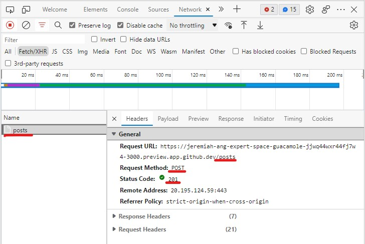
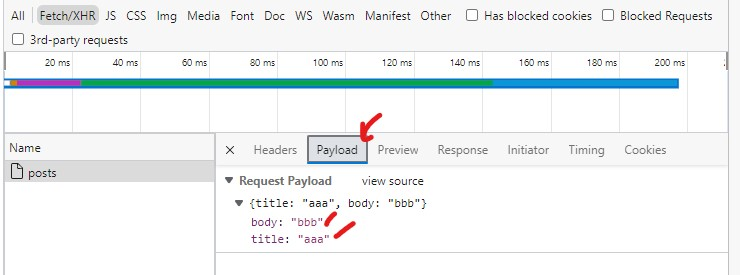
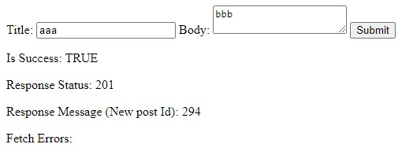
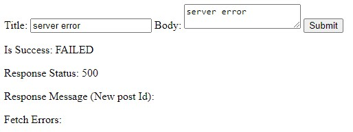
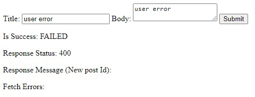
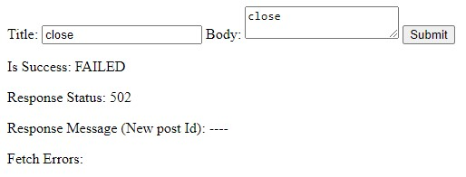
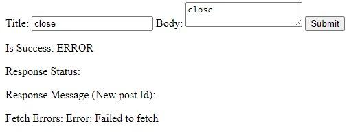

# Fetch Practical

## Setup

1. Run `npm install` to install required packages
2. Run `npm start` to start the server at port 3000
3. Open `http://localhost:3000/create.html` to view the create-page
4. Open `http://localhost:3000/retrieve.html` to view the create-page

## Your Task

1. Modify `create.js` based on the requirement.
2. A sample of how to use `fetch` is provided in `retrieve.js`.
3. You can also consult generative AI like [this](https://chat.openai.com/chat).

## Testing

1. Firstly, you should make sure that you are sending your request correctly.

    1. Open terminal and ensure that you are indeed sending a request when you press send:

        

    2. Make sure you are sending the body correctly

        

2. Enter Title=`aaa` and Body=`bbb`. You should see the following:

    

3. Enter Title=`server error` and Body=`server error`. You should see the following:

    

4. Enter Title=`user error` and Body=`user error`. You should see the following:

    

5. Enter Title=`close` and Body=`close`. You should see the following based on the environment:

    1. Codespaces

        

    2. Local

        

6. (Advanced) Why are there different response on codespace vs local?
